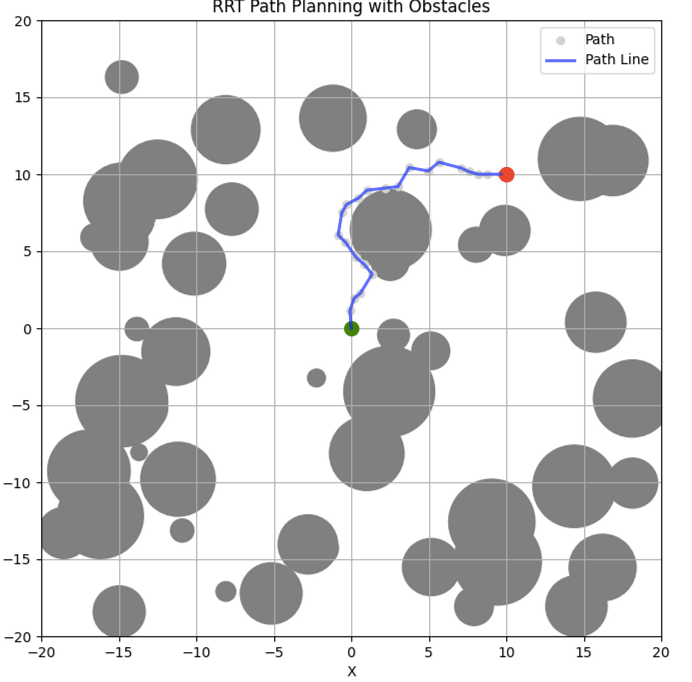
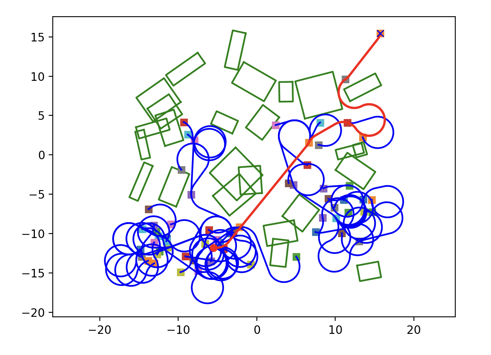
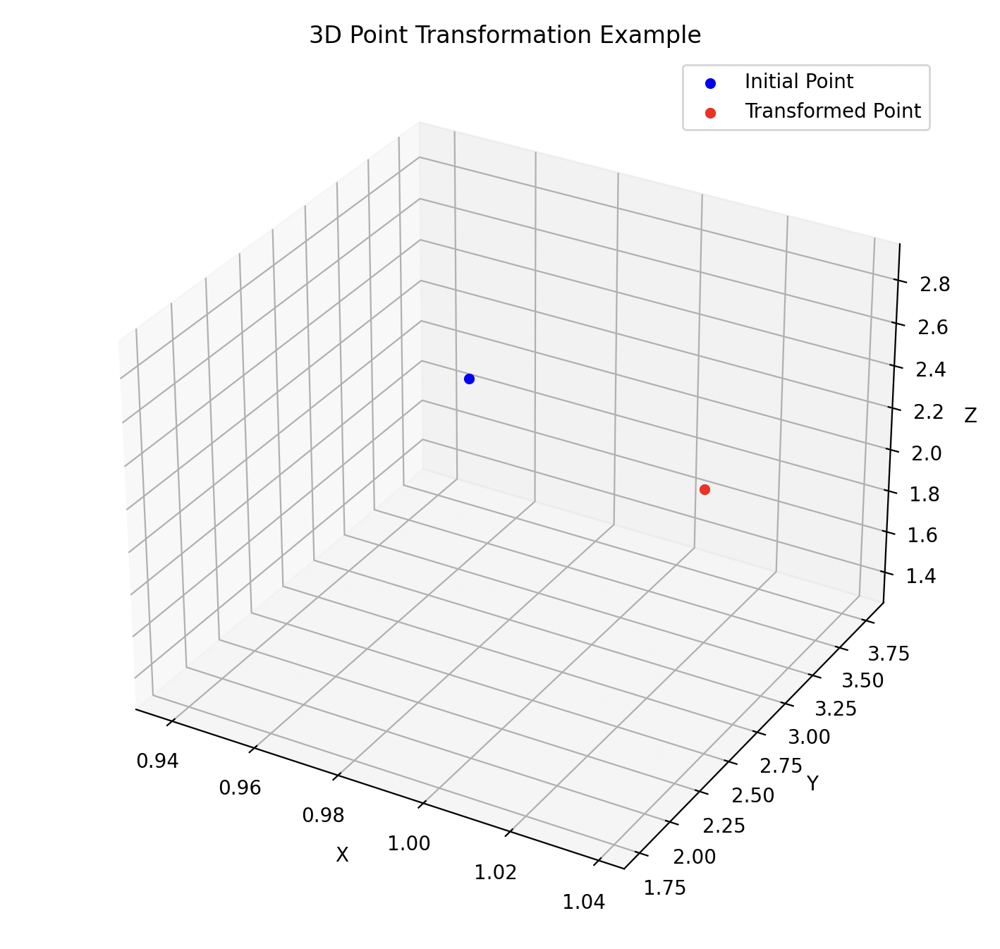

# RRT Path Planning with Obstacles

This is a sample image of the RRT path planning algorithm with obstacles. The image above shows the start point (green), goal point (red), and obstacles (gray circles) in the workspace. The generated paths during the RRT search are also visualized with light blue lines.

# RRTstar Dubins path

for non-holonomic path

# CoordinateTransformation

# Description
Add a brief description of the project here.
